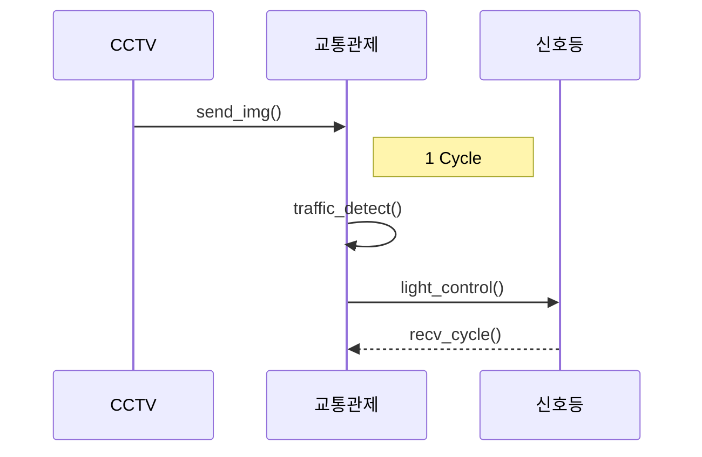
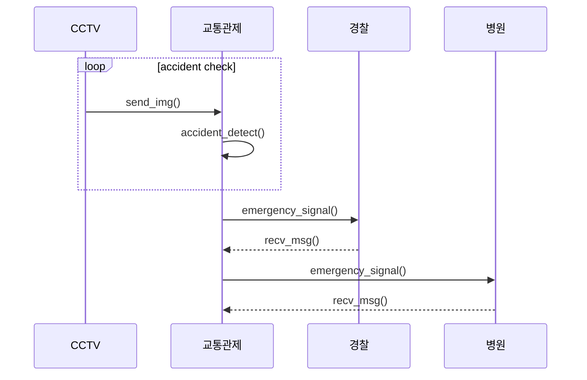
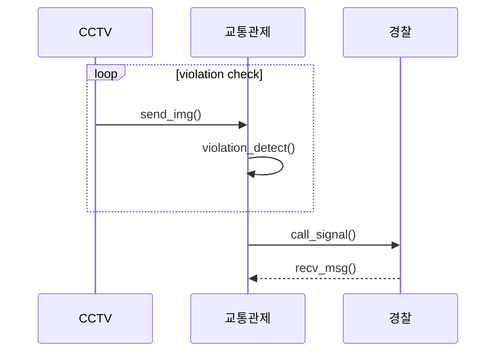

# cctv_ctrl

## Team project

### Team: Watchdogs
### <<프로젝트 요약>>
#### 프로젝트 주제
* 다목적 CCTV 상황제어
거리에 있는 CCTV를 이용하여 트래픽에 따른 신호등 제어 및 각종 사건사고 감지

* 유스케이스


* 클래스 다이어그램


* 시퀀스 다이어그램





## 111702.py환경설정  
---python3.8 사용---
```py
pip install opencv-python
pip install supervision
pip install YOLO
pip install numpy
```
## 팀
* Members
  | Name | Role |
  |----|----|
  | 장석환 | AI_modeling, 사고분석 ai 학습 및 개발1 |
  | 김승현 | AI_modeling, 사고분석 ai 학습 및 개발2 |
  | 김형은 | 문서 제작 및 ppt제작,발표|
  | 서규승 | AI_modeling, 교통통제 및 project maneger|
  | 조성우 | edge_device_control, 신호등 및 raspberry cam제어 |
* Project Github : https://github.com/dnfm257/cctv_ctrl.git
* 발표자료 : https://github.com/dnfm257/cctv_ctrl/blob/main/doc/cctv_ctrl_ppt.pptx
