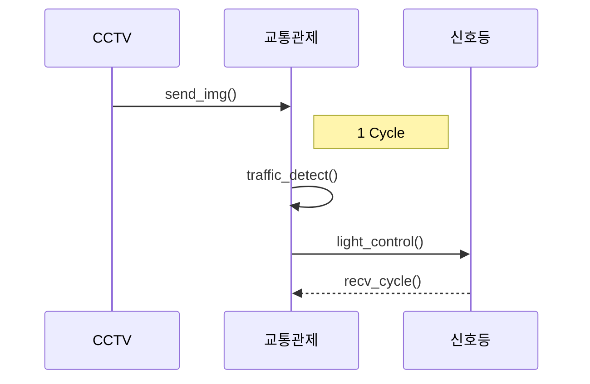
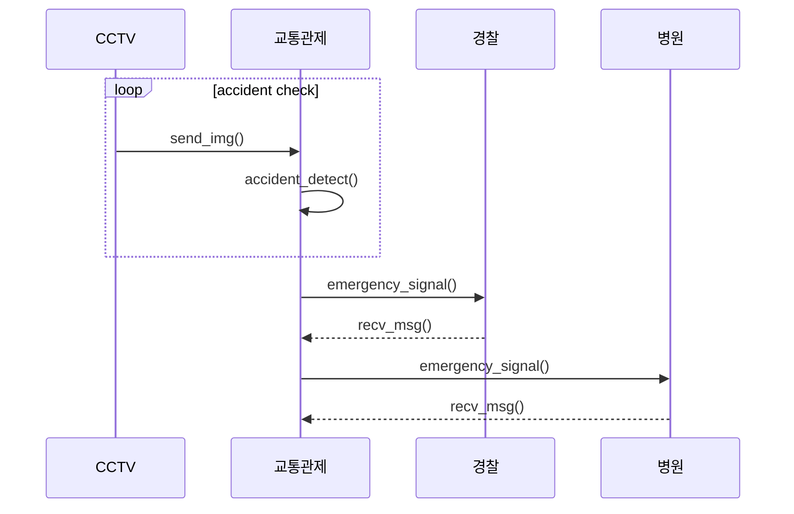
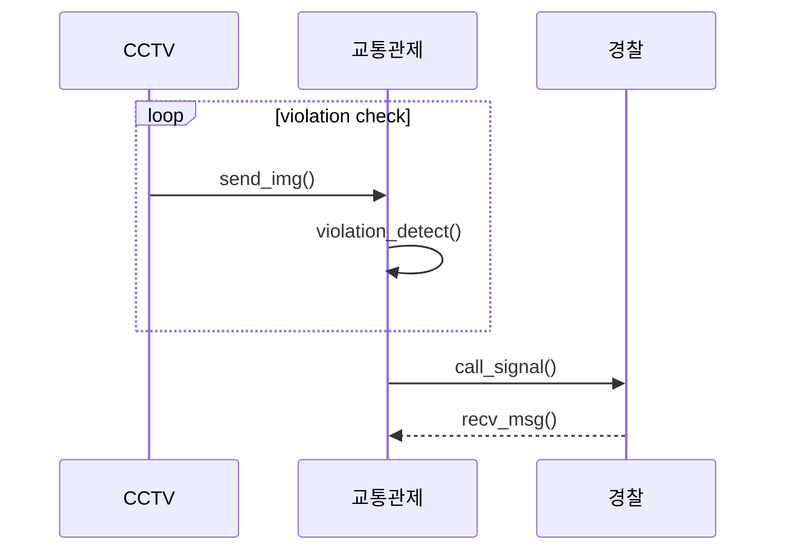

# cctv_ctrl

## Team project

### Team: Watchdogs
<프로젝트 요약>
#### 프로젝트 주제
* 다목적 CCTV 상황제어
거리에 있는 CCTV를 이용하여 트래픽에 따른 신호등 제어 및 각종 사건사고 감지

* 유스케이스

* 클래스 다이어그램

* 시퀀스 다이어그램

* Members
  | Name | Role |
  |----|----|
  | 장석환 | Project lead, 프로젝트를 총괄하고 망하면 책임진다. |
  | 김승현 | Project manager, 마일스톤을 생성하고 프로젝트 이슈 진행상황을 관리한다. |
  | 김형은 | UI design, 사용자 인터페이스를 정의하고 구현한다. |
  | 서규승 | AI modeling, 원하는 결과가 나오도록 AI model을 선택, data 수집, training을 수행한다. |
  | 조성우 | Architect, 프로젝트의 component를 구성하고 상위 디자인을 책임진다. |
* Project Github : https://github.com/goodsense/project_awesome.git
* 발표자료 : https://github.com/goodsense/project_aewsome/doc/slide.ppt
