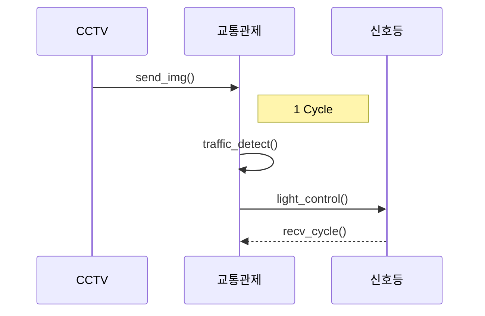
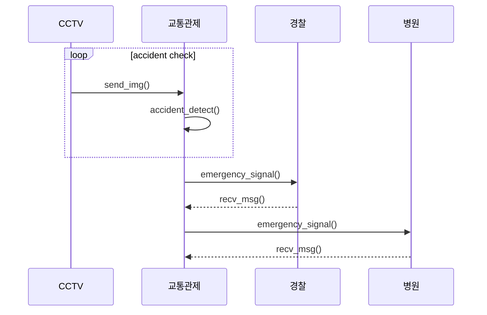
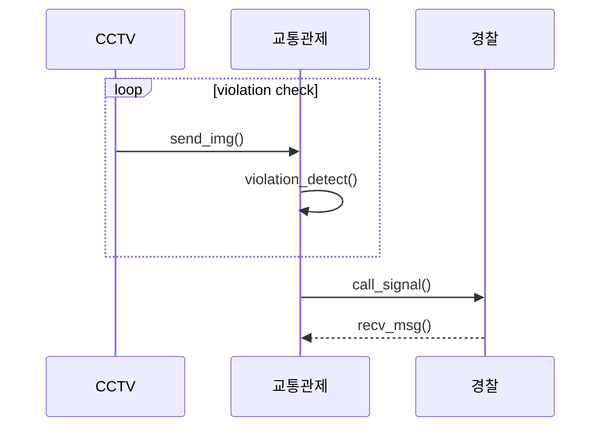

# cctv_ctrl

## Team project

### Team: Watchdogs
<프로젝트 요약>
#### 프로젝트 주제
* 다목적 CCTV 상황제어
거리에 있는 CCTV를 이용하여 트래픽에 따른 신호등 제어 및 각종 사건사고 감지

* 유스케이스

* 클래스 다이어그램

* 시퀀스 다이어그램

* Members
  | Name | Role |
  |----|----|
  | 장석환 | Project lead, 프로젝트 총괄 및 책임 |
  | 김승현 | Project manager, github repository 생성 및 프로젝트 이슈 진행상황 관리 |
  | 김형은 | UI design, 사용자 인터페이스 정의 및 구현 |
  | 서규승 | AI modeling, AI model 선택, data 수집 및 training 수행 |
  | 조성우 | Architect, 프로젝트 component 구성 및 상위 디자인 설계 |
* Project Github : https://github.com/dnfm257/cctv_ctrl.git
* 발표자료 : -
